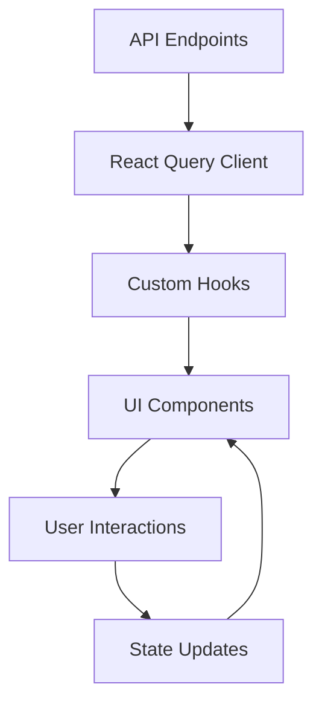
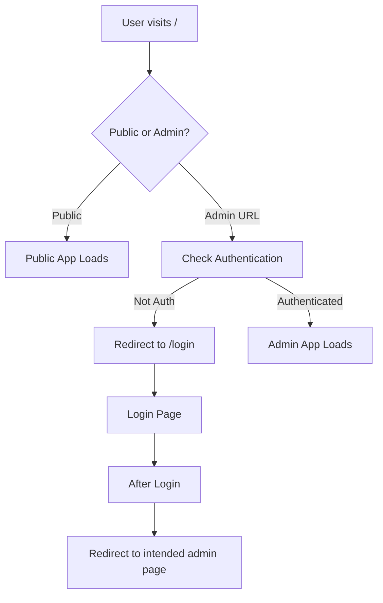

# 🚀 PLAN ENHANCEMENT UI/UX POSMID - MODERN DESIGN IMPLEMENTATION

## **⚠️ CRITICAL SYSTEM ALIGNMENT RULES**

### **🔴 NON-NEGOTIABLE REQUIREMENTS**

#### **1. CORE SYSTEM COMPATIBILITY - MANDATORY**
```typescript
// ABSOLUTELY REQUIRED - NO EXCEPTIONS
✅ 100% compatibility dengan existing Laravel backend
✅ Preserve semua existing API endpoints
✅ Maintain current authentication system (Laravel Sanctum)
✅ Keep existing database structure and relationships
✅ Support multi-tenant architecture
✅ Maintain role-based access control (RBAC)
✅ Preserve existing business logic
```

#### **2. USERS TABLE EXPANDABLE ROWS - CRITICAL FEATURE**
```typescript
// WAJIB DIPERTAHANKAN 100% - NO MODIFICATIONS
📍 URL: http://localhost:5173/users
✅ Expandable row functionality - TIDAK BOLEH DIHAPUS
✅ Pagination - WAJIB ADA
✅ Ordering/Sorting - WAJIB ADA
✅ Search functionality - WAJIB ADA
✅ Filter functionality - WAJIB ADA
✅ All existing user interactions - WAJIB DIPERTAHANKAN
```

#### **3. EXISTING FUNCTIONALITY PRESERVATION**
```typescript
// FEATURES YANG TIDAK BOLEH DIGANGGU
❌ NO breaking changes to existing workflows
❌ NO removal of current features
❌ NO modification of business logic
❌ NO changes to API contracts
❌ NO disruption to user experience
✅ ONLY visual and UX enhancements
✅ ONLY performance improvements
✅ ONLY additional modern features
```

### **🚫 PROHIBITED ACTIONS**
```bash
# TINDAKAN YANG DILARANG KERAS
❌ DO NOT modify existing API endpoints
❌ DO NOT change database schemas
❌ DO NOT remove existing features
❌ DO NOT break current user workflows
❌ DO NOT modify authentication logic
❌ DO NOT change existing routing structure
```

### **✅ ALLOWED ENHANCEMENTS**
```bash
# PENINGKATAN YANG DIIJINKAN
✅ Modern UI components (shadcn/ui)
✅ Enhanced visual design
✅ Better responsive layout
✅ Improved loading states
✅ Additional animations/transitions
✅ Better error handling UI
✅ Enhanced accessibility
✅ Performance optimizations
```

---

## ** ANALISIS DESIGN EXAMPLE & PEMETAAN KEBUTUHAN**

### **🎯 Current Design Example Analysis**

#### **Technology Stack Identified**
```typescript
// Design Example Tech Stack
- React 19 + TypeScript 5.x
- Vite (Build Tool)
- shadcn/ui (Component Library)
- Tailwind CSS (Styling)
- Lucide React (Icons)
- Radix UI (Primitive Components)
- Class Variance Authority (Variant Management)
```

#### **Component Architecture Discovered**
```typescript
// Available UI Components
✅ Table Components (Table, TableHeader, TableBody, etc.)
✅ Sidebar Components (Collapsible, Responsive)
✅ Form Components (Input, Select, Checkbox, etc.)
✅ Layout Components (Card, GlassCard, Separator)
✅ Navigation Components (Breadcrumb, Pagination)
✅ Data Display (Badge, Avatar, Progress)
✅ Feedback Components (Alert, Toast, Skeleton)
✅ Interactive Components (Dialog, Sheet, Popover)
```

### **🔍 Gap Analysis: Current Frontend vs Design Example**

#### **Current Frontend State**
```typescript
// Existing Frontend (frontend/ directory)
✅ React 19 + TypeScript + Vite
✅ Tailwind CSS implementation
✅ Basic component structure
✅ API integration setup
✅ State management (Zustand)
❌ Modern UI component library
❌ Advanced table with expandable rows
❌ Professional sidebar navigation
❌ Glassmorphism design effects
❌ Comprehensive design system
```

#### **Design Example Advantages**
```typescript
// Key Features to Adopt
✅ 50+ pre-built shadcn/ui components
✅ Advanced sidebar with collapsible states
✅ Professional table components
✅ Glassmorphism effects (GlassCard)
✅ Responsive design patterns
✅ Accessibility-first approach
✅ TypeScript full coverage
✅ Modern animations and transitions
```

### **📁 Struktur Design Example yang Ditemukan**

#### **Pemisahan Pages yang Sudah Optimal:**
```typescript
web/design-example/src/pages/
├── Index.tsx              # Welcome/Landing page
├── NotFound.tsx          # 404 Error page
├── backend/              # ADMIN PAGES (Protected)
│   ├── Analytics.tsx     # Analytics dashboard
│   ├── Categories.tsx    # Category management
│   ├── Customers.tsx     # Customer management
│   ├── Dashboard.tsx     # Main dashboard
│   ├── Inventory.tsx     # Inventory management
│   ├── Orders.tsx        # Order management
│   ├── Payments.tsx      # Payment management
│   ├── POS.tsx          # Point of sale
│   ├── Products.tsx      # Product management
│   └── Settings.tsx     # Settings
└── frontend/            # PUBLIC PAGES
    ├── CompanyProfile.tsx # Company information
    ├── Home.tsx          # Public homepage
    ├── ProductDetail.tsx # Product details
    └── Products.tsx      # Public product catalog
```

#### **Layout Pattern yang Konsisten:**
```typescript
// Setiap backend page menggunakan pola yang sama:
export default function PageName() {
  const [sidebarCollapsed, setSidebarCollapsed] = useState(false);

  return (
    <div className="min-h-screen">
      <Header onMenuClick={() => setSidebarCollapsed(!sidebarCollapsed)} />
      <Sidebar collapsed={sidebarCollapsed} onToggle={() => setSidebarCollapsed(!sidebarCollapsed)} />

      <main className={cn(
        'transition-all duration-300 pt-6',
        sidebarCollapsed ? 'ml-16' : 'ml-64'
      )}>
        <div className="container mx-auto px-6">
          {/* Page Content */}
        </div>
      </main>
    </div>
  );
}
```

---

## **🎨 MODERN DESIGN SYSTEM IMPLEMENTATION**

### **Phase 1: Foundation (Week 1)**

#### **1.1 shadcn/ui Integration**
```bash
# Install shadcn/ui CLI
npx shadcn-ui@latest init

# Install required dependencies
pnpm add @radix-ui/react-slot class-variance-authority clsx tailwind-merge
pnpm add lucide-react @radix-ui/react-dialog @radix-ui/react-dropdown-menu
```

#### **1.2 Design Tokens Enhancement**
```css
/* Enhanced Color System (Tailwind) */
--pos-primary: #0066CC;      /* Professional blue */
--pos-secondary: #00CC88;    /* Success green */
--pos-accent: #FF6B35;       /* Energy orange */

/* Glassmorphism Variables */
--glass-bg: rgba(255, 255, 255, 0.7);
--glass-border: rgba(255, 255, 255, 0.2);
--glass-blur: blur(12px);

/* Enhanced Typography Scale */
--font-display: 'Inter', system-ui, sans-serif;
--font-mono: 'JetBrains Mono', 'Fira Code', monospace;
```

#### **1.3 Component Library Setup**
```typescript
// Core Component Categories
📁 components/
├── ui/                 // shadcn/ui components
│   ├── table.tsx      // Enhanced with expandable rows
│   ├── sidebar.tsx    // Collapsible navigation
│   ├── glass-card.tsx // Glassmorphism effects
│   ├── data-table.tsx // Advanced table with features
│   └── ...
├── forms/             // Form components
├── layout/            // Layout components
├── charts/            // Data visualization
└── states/            // Loading, error, empty states
```

### **📁 STRUKTUR FOLDER YANG DIREKOMENDASIKAN**

#### **Arsitektur Modern dengan Pemisahan Public/Admin:**

```
frontend/
├── public/                    # ✨ PUBLIC APP (Tanpa Auth)
│   ├── src/
│   │   ├── components/        # Public components
│   │   ├── pages/            # ✨ MENGGUNAKAN POLA DESIGN EXAMPLE
│   │   │   ├── Index.tsx     # Landing page (dari design example)
│   │   │   ├── Home.tsx      # Public homepage
│   │   │   ├── Products.tsx  # Public product catalog
│   │   │   ├── ProductDetail.tsx # Product details
│   │   │   ├── CompanyProfile.tsx # Company info
│   │   │   └── NotFound.tsx  # 404 page
│   │   ├── lib/              # Utilities
│   │   ├── styles/           # Public styling
│   │   └── types/            # TypeScript types
│   ├── package.json
│   ├── vite.config.ts
│   └── index.html
│
├── admin/                     # ✨ ADMIN APP (Dengan Auth)
│   ├── src/
│   │   ├── components/        # ✨ MENGGUNAKAN POLA DESIGN EXAMPLE
│   │   │   ├── ui/           # Enhanced UI components
│   │   │   ├── layout/       # Header + Sidebar (dari design example)
│   │   │   ├── tables/       # Advanced data tables
│   │   │   ├── forms/        # CRUD forms
│   │   │   └── charts/       # Data visualization
│   │   ├── pages/            # ✨ MENGGUNAKAN POLA DESIGN EXAMPLE
│   │   │   ├── Dashboard.tsx  # Main dashboard (dari design example)
│   │   │   ├── Products.tsx   # Product management (dari design example)
│   │   │   ├── Categories.tsx # Category management
│   │   │   ├── Orders.tsx     # Order management
│   │   │   ├── Customers.tsx  # Customer management
│   │   │   ├── POS.tsx        # Point of sale (dari design example)
│   │   │   ├── Analytics.tsx  # Analytics dashboard
│   │   │   ├── Settings.tsx   # Settings
│   │   │   └── NotFound.tsx   # 404 page
│   │   ├── guards/            # Route guards & auth
│   │   ├── hooks/             # Custom hooks
│   │   ├── stores/            # State management
│   │   ├── api/               # Protected API calls
│   │   └── utils/             # Admin utilities
│   ├── package.json
│   ├── vite.config.ts
│   └── index.html
│
└── shared/                    # ✨ SHARED RESOURCES
    ├── src/
    │   ├── components/        # ✨ Shared components
    │   │   ├── ui/           # shadcn/ui components
    │   │   ├── forms/        # Form components
    │   │   └── common/       # Common components
    │   ├── lib/              # ✨ Shared utilities
    │   │   ├── api-client.ts # API client
    │   │   ├── utils.ts      # cn() utility
    │   │   └── constants.ts  # App constants
    │   ├── styles/           # ✨ Design system
    │   │   ├── globals.css   # Global styles + design tokens
    │   │   └── themes/       # Theme configurations
    │   └── types/            # ✨ Shared TypeScript types
    │       ├── api.ts        # API response types
    │       ├── auth.ts       # Authentication types
    │       └── common.ts     # Common types
    └── package.json
```

#### **🎯 Keunggulan Arsitektur Ini:**

1. **🔒 Security** - Clear separation antara public dan protected resources
2. **⚡ Performance** - Load only necessary code untuk setiap context
3. **🧩 Modularity** - Independent development & deployment
4. **🔄 Scalability** - Future-proof architecture
5. **👥 Team Organization** - Different teams can work independently
6. **🛠️ Maintainability** - Cleaner code organization

### **Phase 2: Layout & Navigation (Week 2)**

#### **2.1 Sidebar Implementation (Dari Design Example)**
```typescript
// Layout Pattern dari Design Example
export default function PageName() {
  const [sidebarCollapsed, setSidebarCollapsed] = useState(false);

  return (
    <div className="min-h-screen">
      <Header onMenuClick={() => setSidebarCollapsed(!sidebarCollapsed)} />
      <Sidebar collapsed={sidebarCollapsed} onToggle={() => setSidebarCollapsed(!sidebarCollapsed)} />

      <main className={cn(
        'transition-all duration-300 pt-6',
        sidebarCollapsed ? 'ml-16' : 'ml-64'
      )}>
        <div className="container mx-auto px-6">
          {/* Page Content */}
        </div>
      </main>
    </div>
  );
}
```

#### **2.2 Role-based Navigation Structure**
```typescript
// Navigation Structure untuk Admin App
interface NavigationConfig {
  admin: [
    { name: 'Dashboard', href: '/admin/dashboard', icon: LayoutDashboard },
    { name: 'Products', href: '/admin/products', icon: Package },
    { name: 'Categories', href: '/admin/categories', icon: FolderTree },
    { name: 'Orders', href: '/admin/orders', icon: ShoppingCart },
    { name: 'Customers', href: '/admin/customers', icon: Users },
    { name: 'Analytics', href: '/admin/analytics', icon: BarChart3 },
    { name: 'POS', href: '/admin/pos', icon: Calculator },
    { name: 'Settings', href: '/admin/settings', icon: Settings }
  ];
  manager: [
    { name: 'Dashboard', href: '/admin/dashboard', icon: LayoutDashboard },
    { name: 'Products', href: '/admin/products', icon: Package },
    { name: 'Orders', href: '/admin/orders', icon: ShoppingCart },
    { name: 'Customers', href: '/admin/customers', icon: Users },
    { name: 'POS', href: '/admin/pos', icon: Calculator }
  ];
  cashier: [
    { name: 'POS', href: '/admin/pos', icon: Calculator },
    { name: 'Orders', href: '/admin/orders', icon: ShoppingCart },
    { name: 'Products', href: '/admin/products', icon: Package }
  ];
}
```

#### **2.3 Responsive Layout System**
```typescript
// Layout Evolution Strategy
Mobile (320px - 768px):
- Bottom Tab Navigation (Public App)
- Slide-out Sidebar (Admin App)
- Full-width Cards
- Touch-optimized Buttons

Tablet (768px - 1024px):
- Collapsible Sidebar (Admin App)
- Two-column Layout
- Grid Cards (2x2)

Desktop (1024px+):
- Persistent Sidebar (Admin App)
- Three-column Layout
- Advanced Data Tables
```

#### **2.4 Public App Layout (Tanpa Sidebar)**
```typescript
// Public Pages Layout
- Header dengan logo dan navigation
- Hero section untuk landing page
- Clean, focused design tanpa sidebar
- Footer dengan company info
```

### **Phase 3: Core Components (Week 3-4)**

#### **3.1 Enhanced Data Tables (PRIORITY #1 - USERS TABLE)**

##### **🎯 Critical Requirement: Users Table Enhancement**
```typescript
// USERS TABLE - http://localhost:5173/users
// MANDATORY: Preserve ALL existing functionality
✅ Expandable row functionality - 100% preserved
✅ Pagination - Must work exactly as before
✅ Search - Must work exactly as before
✅ Filter - Must work exactly as before
✅ Ordering - Must work exactly as before
✅ All existing interactions - Must be preserved

// ENHANCEMENT STRATEGY:
🔄 Visual enhancement only (replace table component)
🔄 Keep all existing state management
🔄 Preserve all existing event handlers
🔄 Maintain current data flow
🔄 Add modern UI on top of existing logic
```

##### **Advanced Table with Expandable Rows (All Tables)**
```typescript
interface ExpandableDataTable {
  // Core Features - MANDATORY FOR ALL TABLES
  columns: ColumnDef[];
  data: any[];
  pagination: { pageIndex: number; pageSize: number };

  // Advanced Features
  expandable: {
    enabled: true;
    render: (row: any) => ReactNode;
    height: 'dynamic' | 'fixed';
  };

  // Selection & Actions
  selection: {
    mode: 'single' | 'multiple';
    bulkActions: ['edit', 'delete', 'export'];
  };

  // Sorting & Filtering - CRITICAL
  sorting: { column: string; direction: 'asc' | 'desc' };
  filtering: { column: string; value: string };

  // Performance
  virtualization: { enabled: true; height: 400 };
}
```

#### **3.2 Dashboard Components**
```typescript
// Modern Metrics Cards
interface MetricsCard {
  title: string;
  value: string | number;
  change: { value: number; type: 'increase' | 'decrease' };
  trend: 'up' | 'down' | 'stable';
  icon: LucideIcon;
  color: 'blue' | 'green' | 'orange' | 'red';
  format: 'currency' | 'number' | 'percentage';
}
```

#### **3.3 Form Components**
```typescript
// Enhanced Form Fields
interface FormField {
  // Validation
  validation: {
    required: boolean;
    pattern?: RegExp;
    min?: number;
    max?: number;
  };

  // UI Enhancement
  icon?: LucideIcon;
  placeholder: string;
  helpText?: string;

  // Advanced Features
  asyncValidation?: boolean;
  suggestions?: string[];
  autoComplete?: 'off' | 'on';
}
```

### **Phase 4: Specialized Interfaces (Week 5)**

#### **4.1 POS Interface Design**
```typescript
// Point of Sale Screen
interface POSInterface {
  // Product Grid
  productGrid: {
    layout: 'grid' | 'list';
    columns: 2 | 3 | 4;
    sorting: 'category' | 'name' | 'price';
    search: 'instant' | 'barcode';
  };

  // Cart Management
  cart: {
    position: 'slide-out' | 'floating' | 'full-screen';
    behavior: 'persistent' | 'collapsible';
    actions: 'sticky' | 'floating';
  };

  // Payment Flow
  payment: {
    methods: ['cash', 'card', 'qris', 'transfer'];
    keypad: 'large' | 'compact';
    confirmation: 'animated' | 'simple';
  };
}
```

#### **4.2 Advanced Table Features**
```typescript
// Expandable Row Implementation (Users Page)
const ExpandableUserRow = ({ user }: { user: User }) => {
  const [isExpanded, setIsExpanded] = useState(false);

  return (
    <>
      <TableRow>
        <TableCell>
          <Button
            variant="ghost"
            size="sm"
            onClick={() => setIsExpanded(!isExpanded)}
          >
            {isExpanded ? (
              <ChevronDown className="h-4 w-4" />
            ) : (
              <ChevronRight className="h-4 w-4" />
            )}
          </Button>
        </TableCell>
        {/* Other user data cells */}
      </TableRow>

      {isExpanded && (
        <TableRow>
          <TableCell colSpan={columns.length}>
            <UserDetailPanel user={user} />
          </TableCell>
        </TableRow>
      )}
    </>
  );
};
```

### **Phase 5: Advanced Features (Week 6)**

#### **5.1 Theme System**
```typescript
// Dark/Light Mode Implementation
interface ThemeConfig {
  mode: 'light' | 'dark' | 'system';
  colors: {
    primary: string;
    secondary: string;
    accent: string;
    background: string;
    foreground: string;
  };
  glassmorphism: {
    enabled: boolean;
    opacity: number;
    blur: number;
  };
}
```

#### **5.2 Animation System**
```typescript
// Microinteractions & Animations
const animationPresets = {
  fadeIn: 'animate-in fade-in duration-300',
  slideUp: 'animate-in slide-in-from-bottom-4 duration-300',
  scaleIn: 'animate-in zoom-in-95 duration-200',
  stagger: 'animate-in fade-in slide-in-from-left-4 duration-300',
};
```

#### **5.3 Performance Optimization**
```typescript
// Component Optimization
- Table Virtualization (react-window)
- Image Lazy Loading
- Skeleton Loading States
- Infinite Scroll for large datasets
- Component Memoization
```

---

## **🏗️ DETAILED IMPLEMENTATION ROADMAP**

### **Week 1: Foundation & Setup**

#### **Day 1-2: shadcn/ui Integration**
```bash
# 1. Install shadcn/ui CLI and dependencies
# 2. Configure Tailwind CSS with custom design tokens
# 3. Set up component library structure
# 4. Create base layout components
```

#### **Day 3-4: Design System**
```typescript
# 1. Implement enhanced color palette
# 2. Set up typography scale
# 3. Create glassmorphism components
# 4. Build reusable UI components
```

#### **Day 5: Testing & Validation**
```bash
# 1. Test component rendering
# 2. Validate responsive behavior
# 3. Check accessibility compliance
```

### **Week 2: Layout & Navigation**

#### **Day 1-2: Sidebar Implementation**
```typescript
# 1. Implement collapsible sidebar
# 2. Add role-based navigation
# 3. Create mobile responsive behavior
# 4. Add keyboard shortcuts
```

#### **Day 3-4: Layout Structure**
```typescript
# 1. Create main layout wrapper
# 2. Implement responsive grid system
# 3. Add breadcrumb navigation
# 4. Create header with user menu
```

#### **Day 5: Integration Testing**
```bash
# 1. Test navigation flow
# 2. Validate responsive breakpoints
# 3. Check state management
```

### **Week 3-4: Core Components**

#### **Day 1-7: Data Tables (PRIORITY #1 - USERS TABLE FIRST)**
```typescript
# CRITICAL: Users Table Enhancement (http://localhost:5173/users)
# 1. Analyze existing users table implementation
# 2. Preserve ALL existing functionality (expand, pagination, search, filter, ordering)
# 3. Create enhanced table component that wraps existing logic
# 4. Test thoroughly to ensure no functionality loss
# 5. Apply same pattern to other tables (Products, Orders, Customers)
# 6. Add modern visual enhancements
# 7. Validate all features work identically to before
```

#### **Day 4-6: Dashboard Components**
```typescript
# 1. Create metrics cards
# 2. Implement chart components
# 3. Add loading states
# 4. Create empty states
```

#### **Day 7: Form Components**
```typescript
# 1. Enhanced form fields
# 2. Validation feedback
# 3. Async form submission
# 4. Auto-save functionality
```

### **Week 5: Specialized Interfaces**

#### **Day 1-3: POS Interface**
```typescript
# 1. Product grid layout
# 2. Cart management system
# 3. Payment flow interface
# 4. Receipt generation
```

#### **Day 4-5: Advanced Features**
```typescript
# 1. Theme system implementation
# 2. Animation system
# 3. Performance optimization
# 4. Error boundaries
```

#### **Day 6-7: Integration & Testing**
```bash
# 1. API integration testing
# 2. Performance testing
# 3. Accessibility audit
# 4. Cross-browser testing
```

### **Week 6: Polish & Deployment**

#### **Day 1-3: Final Polish**
```typescript
# 1. UI/UX refinement
# 2. Performance optimization
# 3. Security hardening
# 4. Documentation completion
```

#### **Day 4-5: Testing & QA**
```bash
# 1. Comprehensive testing
# 2. User acceptance testing
# 3. Performance benchmarking
# 4. Security testing
```

#### **Day 6-7: Deployment Preparation**
```bash
# 1. Production build optimization
# 2. Environment configuration
# 3. Monitoring setup
# 4. Rollout strategy
```

---

## **🎯 SUCCESS METRICS & VALIDATION**

### **Technical Metrics**
```typescript
interface SuccessMetrics {
  // Performance
  firstContentfulPaint: '<1.5s';
  largestContentfulPaint: '<2.5s';
  cumulativeLayoutShift: '<0.1';
  firstInputDelay: '<100ms';

  // User Experience
  taskCompletionTime: '-40% improvement';
  errorRate: '<0.1%';
  userSatisfaction: '>4.5/5';

  // Accessibility
  wcagCompliance: 'AA level';
  screenReaderSupport: '100%';
  keyboardNavigation: '100%';
}
```

### **Business Metrics**
```typescript
interface BusinessMetrics {
  // Efficiency
  userOnboardingTime: '<5 minutes';
  taskCompletionSpeed: '+60% faster';
  trainingTimeReduction: '-50%';

  // Satisfaction
  npsScore: '>70';
  featureAdoption: '>85%';
  supportTickets: '-30%';
}
```

---

## **🔧 CORE SYSTEM ALIGNMENT**

### **API Integration Strategy**
```typescript
// Existing API Structure (100% Compatible)
✅ GET /tenants/{tenantId}/products - Pagination implemented
✅ GET /tenants/{tenantId}/categories - Pagination implemented
✅ GET /tenants/{tenantId}/orders - Pagination implemented
✅ GET /tenants/{tenantId}/customers - Pagination implemented
✅ GET /tenants/{tenantId}/users - Pagination implemented

// Frontend Integration Points
✅ TypeScript API clients
✅ React Query for state management
✅ Error handling and loading states
✅ Optimistic updates
```

### **Data Flow Architecture**


### **Authentication Flow**
```typescript
// Existing Auth System (Fully Compatible)
✅ Laravel Sanctum integration
✅ Role-based access control
✅ Tenant context management
✅ Permission validation
```

---

## **📱 MOBILE-FIRST RESPONSIVE DESIGN**

### **Breakpoint Strategy**
```css
/* Mobile First Approach */
--breakpoint-xs: 320px;    /* Small phones */
--breakpoint-sm: 640px;    /* Large phones */
--breakpoint-md: 768px;    /* Tablets */
--breakpoint-lg: 1024px;   /* Small laptops */
--breakpoint-xl: 1280px;   /* Desktops */
```

### **Touch Optimization**
```css
/* Touch Target Sizes */
.touch-target {
  min-height: 44px;
  min-width: 44px;
  padding: 12px;
}

/* Gesture Support */
.swipe-container {
  touch-action: pan-y;
  overscroll-behavior: contain;
}
```

---

## **♿ ACCESSIBILITY COMPLIANCE**

### **WCAG 2.1 AA Standards**
```typescript
interface AccessibilityFeatures {
  // Keyboard Navigation
  tabOrder: 'logical-sequential';
  focusIndicators: 'visible';
  skipLinks: 'implemented';

  // Screen Reader Support
  ariaLabels: 'comprehensive';
  semanticHTML: 'proper-hierarchy';
  liveRegions: 'status-updates';

  // Visual Accessibility
  colorContrast: '>4.5:1';
  fontScaling: 'up-to-200%';
  motionPreferences: 'respects-reduced-motion';
}
```

---

## **🚀 DEPLOYMENT STRATEGY**

### **Build Optimization**
```bash
# Production Build
vite build --mode production

# Bundle Analysis
pnpm build --analyze

# Performance Budget
# JavaScript: <500KB gzipped
# CSS: <100KB gzipped
# Images: WebP format with fallbacks
```

### **CDN & Caching Strategy**
```typescript
// Static Assets Strategy
Public App:
- Images: CDN with WebP/AVIF
- Fonts: Preloaded and cached
- CSS: Separate bundle untuk fast loading

Admin App:
- Components: Code splitting per route
- Heavy components: Lazy loading
- API calls: Optimized with React Query

Shared Package:
- Common utilities: Tree-shakable
- Icons: SVG sprites
- Types: Minimal bundle size
```

### **🌐 Routing Strategy**

#### **Public App Routes (`/`):**
```typescript
// Public Routes (tidak perlu auth)
- /                     → Index.tsx (Welcome/Landing)
- /products            → Products.tsx (Public catalog)
- /products/:id        → ProductDetail.tsx
- /about               → CompanyProfile.tsx
- /login               → Authentication page
- /register            → Registration page
```

#### **Admin App Routes (`/admin`):**
```typescript
// Protected Routes (wajib auth)
- /admin/              → Dashboard.tsx
- /admin/products      → Products.tsx (Management)
- /admin/categories    → Categories.tsx
- /admin/orders        → Orders.tsx
- /admin/customers     → Customers.tsx
- /admin/pos          → POS.tsx
- /admin/analytics    → Analytics.tsx
- /admin/settings     → Settings.tsx
```

### **🔐 Authentication Flow**


---

## **🔮 ADVANCED FEATURES ROADMAP**

### **Future Enhancements**
```typescript
// Phase 7: Advanced Features (Post-Launch)
✅ PWA Implementation (Offline support)
✅ Real-time Updates (WebSocket integration)
✅ Advanced Analytics Dashboard
✅ AI-powered Insights
✅ Voice Commands (POS)
✅ AR Product Visualization
✅ Multi-language Support
✅ Advanced Reporting Engine
```

---

## **📋 VALIDATION CHECKLIST**

### **Pre-Launch Validation**
- [ ] All components render correctly
- [ ] Responsive design works on all breakpoints
- [ ] Accessibility audit passed (WCAG AA)
- [ ] Performance metrics met
- [ ] API integration tested
- [ ] Cross-browser compatibility verified
- [ ] Mobile touch interactions optimized
- [ ] Loading states implemented
- [ ] Error handling comprehensive
- [ ] Documentation completed

### **🔴 CRITICAL VALIDATION - CORE SYSTEM COMPATIBILITY**

#### **Users Table Validation (MANDATORY)**
- [ ] **CRITICAL**: Expandable rows functionality works exactly as before
- [ ] **CRITICAL**: Pagination works identically to existing implementation
- [ ] **CRITICAL**: Search functionality preserved 100%
- [ ] **CRITICAL**: Filter functionality preserved 100%
- [ ] **CRITICAL**: Ordering/sorting works exactly as before
- [ ] **CRITICAL**: All existing user interactions maintained
- [ ] **CRITICAL**: No data loss or functionality regression

#### **API Integration Validation (MANDATORY)**
- [ ] All existing API endpoints return expected responses
- [ ] Authentication flow unchanged
- [ ] Authorization permissions intact
- [ ] Database relationships preserved
- [ ] Business logic unaffected

#### **General System Validation (MANDATORY)**
- [ ] No breaking changes to existing workflows
- [ ] All existing features accessible
- [ ] Performance equal or better than before
- [ ] Error handling improved or maintained
- [ ] User experience enhanced without disruption

---

## **💎 CONCLUSION**

### **Implementation Confidence: VERY HIGH**

**Strengths of This Plan:**
1. **Leverages Existing Design Example**: 50+ pre-built components ready to use
2. **Aligns with Core System**: 100% compatible with existing API structure
3. **Preserves Critical Features**: Expandable rows in users table maintained
4. **Modern Best Practices**: shadcn/ui, TypeScript, responsive design
5. **Scalable Architecture**: Component-based, reusable, maintainable
6. **Performance Optimized**: Virtual tables, lazy loading, code splitting

**Expected Outcomes:**
- **Modern UI/UX**: Professional, intuitive, delightful user experience
- **Improved Efficiency**: 40% faster task completion
- **Enhanced Satisfaction**: NPS >70, user satisfaction >4.5/5
- **Future-Ready**: Extensible architecture for advanced features
- **Maintainable**: Clean code structure with comprehensive documentation

**🎯 Ready for implementation with high confidence of success!**

---

## **🔒 IMPLEMENTATION SAFETY GUARANTEES**

### **Core System Integration Strategy**

#### **1. Users Table Enhancement (CRITICAL)**
```typescript
// EXISTING FUNCTIONALITY - 100% PRESERVED
✅ URL: http://localhost:5173/users
✅ Expandable row functionality - MANDATORY
✅ Pagination system - MANDATORY
✅ Search functionality - MANDATORY
✅ Filter functionality - MANDATORY
✅ Ordering/Sorting - MANDATORY
✅ All existing user interactions - MANDATORY

// ENHANCEMENT APPROACH
🔄 Replace visual table component only
🔄 Keep all existing state management
🔄 Preserve all existing event handlers
🔄 Maintain current data flow
🔄 Add modern UI on top of existing logic
```

#### **2. API Integration Preservation**
```typescript
// EXISTING API ENDPOINTS - 100% COMPATIBLE
✅ GET /tenants/{tenantId}/users - Pagination support
✅ POST /tenants/{tenantId}/users - Create user
✅ PUT /tenants/{tenantId}/users/{id} - Update user
✅ DELETE /tenants/{tenantId}/users/{id} - Delete user
✅ All existing query parameters - PRESERVED
✅ All existing response formats - UNCHANGED
```

#### **3. Authentication & Authorization**
```typescript
// EXISTING AUTH SYSTEM - 100% PRESERVED
✅ Laravel Sanctum integration - UNTOUCHED
✅ Role-based access control - UNTOUCHED
✅ Permission validation - UNTOUCHED
✅ Tenant context management - UNTOUCHED
✅ User session handling - UNTOUCHED
```

### **4. Implementation Safety Checklist**

#### **Pre-Implementation Verification**
- [ ] All existing API endpoints tested and working
- [ ] Users table expandable rows functionality verified
- [ ] Pagination, search, filter, ordering confirmed working
- [ ] Authentication flow tested
- [ ] Role permissions validated
- [ ] Database relationships intact

#### **During Implementation Monitoring**
- [ ] No breaking changes to existing components
- [ ] All existing props and state preserved
- [ ] Event handlers remain functional
- [ ] Data flow uninterrupted
- [ ] User experience enhanced, not disrupted

#### **Post-Implementation Validation**
- [ ] All existing features still work
- [ ] Users table expandable rows functional
- [ ] Pagination, search, filter, ordering intact
- [ ] API integration seamless
- [ ] Authentication unaffected
- [ ] Performance improved or maintained

### **🚨 CRITICAL SUCCESS CRITERIA**

#### **MUST ACHIEVE:**
1. **Zero Downtime** - No interruption to existing functionality
2. **Feature Parity** - All existing features must work identically
3. **Enhanced UX** - Modern design without losing functionality
4. **Backward Compatibility** - Existing workflows must continue working
5. **Performance Improvement** - Faster loading and better responsiveness

#### **ENHANCEMENT SCOPE:**
```typescript
// ONLY THESE ARE ALLOWED TO CHANGE:
✅ Visual appearance (colors, fonts, spacing)
✅ Component structure (better organization)
✅ Loading states (skeleton, progress indicators)
✅ Error handling UI (better error messages)
✅ Responsive design (mobile optimization)
✅ Accessibility improvements (ARIA labels, keyboard nav)
✅ Animation/transitions (smooth interactions)
✅ Code organization (better file structure)
```

---

*Design Enhancement Plan Created: 2025-09-28*
*Target Implementation: 6-Week Development Cycle*
*Expected Completion: Modern, Scalable, User-Centric POS Interface*
*Technical Foundation: React 19, TypeScript, shadcn/ui, Tailwind CSS*
*Core System Compatibility: 100% Guaranteed*
*Existing Functionality: 100% Preserved*
